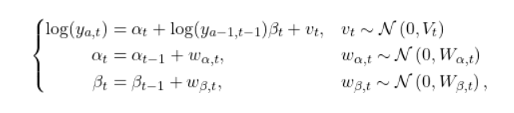

<!-- README.md is generated from README.Rmd. Please edit that file -->

# sibregresr

<!-- badges: start -->
<!-- badges: end -->

The goal of sibregresr is to predict salmon returns using sibling
regression. The regressions are conducted within a dynamic linear
modeling framework and model averaging is used.

## Installation

You can install the development version of sibregresr from
[GitHub](https://github.com/) with:

``` r
# install.packages("devtools")
devtools::install_github("wdfw-fp/sibregresr")
```

## Example

This is a basic example which shows you how to solve a common problem:

``` r
library(sibregresr)
## basic example code

## to come...
```

## Methods description

The first step in forecasting the returns of a given stock $y_{a,t}$ of
age $a$ in year $t$ is to fit eight different models to observed returns
through year $t-1$. The eight different models are variations of a
sibling regression model fit on the log scale with time-varying
intercept and slope:



<!-- $$ -->
<!-- \left\{\begin{aligned} -->
<!-- \mathrm{log}(y_{a,t}) & =\alpha_t+\mathrm{log}(y_{a-1,t-1}) \beta_t+v_t, & & v_t  \sim \mathcal{N}\left(0, V_t\right) \\ -->
<!-- \alpha_t & =\alpha_{t-1}+w_{\alpha, t}, & & w_{\alpha, t} \sim \mathcal{N}\left(0, W_{\alpha, t}\right) \\ -->
<!-- \beta_t & =\beta_{t-1}+w_{\beta, t}, & & w_{\beta, t} \sim \mathcal{N}\left(0, W_{\beta, t}\right) , -->
<!-- \end{aligned}\right. -->
<!-- $$  -->

where $\alpha_t$ and $\beta_t$ are an intercept and a slope for the
log-transformed returns of the previous age in the previous year,
respectively, and both are allowed to vary across years as random walks
with process error variances $w_{\alpha, t}$ and $w_{\beta, t}$
respectively. The residual $v_t$ is assumed to be normally distributed
around zero with variance $V_t$. Together with a vague prior
distribution for the values of $\alpha_0$ and $\beta_0$ (the slope and
intercept prior to the first year) these equations define the “full”
sibling regression models.

The seven other models are simplified versions of this full model
where: 

1) the slope is assumed to constant through time (i.e.,
$w_{\beta, t}=0$);
2) the intercept is assumed to be constant through
time;
3) the slope and intercept are assumed to be constant through
time;
4) the intercept is assumed to be zero (i.e., $\alpha_t=0$);  
5) the intercept is assumed to be zero and the slope is assumed to be
constant through time;  
6) the slope is assumed to be zero; and  
7) the slope is assumed to be zero and the intercept is assumed to be
constant through time.

Together with the full model, this list comprises the eight models
considered in forecasting. The models are fit using the `dlm` package
(Petris 2010) in the R statistical computing environment.

Once the eight models have been fit, each is used to make a prediction
of returns in the upcoming year and an ensemble forecast is generated by
taking a weighted average of the predictions. By default, the ensemble
model weights are calculated for each model $m$ in the set
($\mathcal{M}$) of 8 models based on their AICc,

<!-- $$ -->
<!-- w_m=\frac{e^{-0.5\left(\mathrm{AIC}_m-\mathrm{AIC}_{\min }\right)}}{\sum_{i \in \mathcal{M}} e^{-0.5\left(\mathrm{AIC}_i-\mathrm{AIC}_{\min }\right)}}, -->
<!-- $$ -->


Alternatively, the user may choose to weight models based on their
observed performance $\mathrm{Perf}$ in previous years measured by the
reciprocal of mean absolute percent error or root mean square error.

<!-- $$ -->
<!-- w_m=\frac{\mathrm{Perf}_m^{-1}}{\sum_{i \in \mathcal{M}} \mathrm{Perf}_i^{-1}}, -->
<!-- $$ -->


Giovanni Petris (2010). An R Package for Dynamic Linear Models. Journal
of Statistical Software, 36(12), 1-16. URL
<https://www.jstatsoft.org/v36/i12/>.

Petris, Petrone, and Campagnoli. Dynamic Linear Models with R. Springer
(2009).
